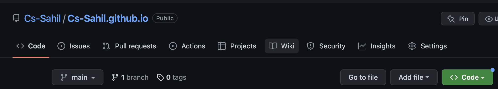

# GitHub-Powered Resume


## PURPOSE
- This README has two objectives:
    * This guide will offer step-by-step instructions for hosting and formatting a resume using GitHub, Jekyll, VS Code, Markdown.

    * In accordance with Andrew Etter's book, Modern Technical Writing, the practical steps outlined will be related to the general principles of current Technical Writing


## PREREQUISITES
- To begin with, we require a resume that is formatted in Markdown.
- Please see the [Resume](https://github.com/Cs-Sahil/Cs-Sahil.github.io/blob/main/index.md) formatted in Markdown.


## INSTRUCTIONS  

- **_I'll start with the practical steps for hosting the resume and then relate each step or group of steps to a concept from Etter's book._**

### Step 1: GitHub Account Setup
 - Visit the GitHub official Website at [github.com](https://github.com/)
 - Click on the `Sign up` button located at top right corner of the homepage.
 - Enter your email address.
 - Create your password.
 - Create username and click `continue`.
 - Enter `n` to avoid getting updated in your email.    
 - Verify your account by solving the puzzle and click `create account`.
 - Enter the launch code sent to the email address you used to create your account.
 - Choose your personal preferences and click `continue`.
 - Select the features you want in GitHub and click `continue`.
 - Choose a plan. Click `Continue for free` to create a free GitHub account.
 - Congratulations!! 🥳 You created a GitHub account. (Next Step: Create a New Repository..👇)

### Step 2: Creating a New Repository
 - Click on the `New` at the top left corner of the homepage.
 

 - Enter your repository name as `username.github.io` format.
  

- Click on the `Public` option.
 

- Click on `Create repository` button at bottom of the page.
- Congratulations!!👏 You created a new GitHub repository.

----

#### Etter's Concept 1: Use Distributed Version Control 

Etter recommends using Distributed Version Control Systems (DVCS) in his book _Modern Technical Writing_ because it is superior to Centralized Version Control Systems in many ways, including better performance, the ability to work offline, and greater flexibility.
There are several DVCS systems to choose from, including GitHub Pages and Codeberg Pages. However, we are hosting our resume on GitHub pages.

[Step 1](#step-1-github-account-setup) demonstrates how to configure the Distributed Version Control System **(GitHub Pages)**. Etter stated in his book that modern technical writers must use DVCS because developers prefer it.

[Step 2](#step-2-creating-a-new-repository) illustrates how to use DVCS and create a new repository. Etter recommends that contemporary technical writers keep their documentation in the same repository as the source code for the product.


-----


### Step 3: Creating the New File in GitHub

- Click on the `creating a new file` after creating the repository.
 


- Name the file `_config.yml` and enter the following Jekyll theme in the `Edit new File` dialogue box.

    ```
    remote_theme: pages-themes/cayman@v0.2.0
    plugins:
    jekyll-remote-theme # add this line to the plugins list if you already have one
    
    ```     
- Write a commit message under `Commit changes`.
- Click on the `Commit new file`  button.


### Step 4: Upload Your Resume

- Click on `Add file` located under the setting icon ⚙️.
- Select the `Upload files` option.


- Drag or browse your Markdown-formatted resume.
- Write a commit message under `Commit changes`.
- Click `Commit Changes`.
- Congratulations!!👏 you have sucessfully uploaded your resume to GitHub.

----
#### Etter's Concept 2: Use Lightweight Markup

Etter's encourage that writers should use lightweight markup languages like Markdown, AsciiDoc, and reStructuredText. We formatted our resume using Markdown in this case. For a Markdown tutorial, please see the [More Resources](#more-resources) section.

Etter mentioned that while writing a resume in word is a great option, technical writers should avoid doing so because it is a terrible way to write documentation. However, word is not free to use and is only available on Windows and MacOS, whereas lightWeight markup is free to use and can be used to host a website.

There are several free editors for lightweight markup available:
 - Atom
 - Visual Studio Code
 - Vim
 - TextWrangler

I formatted my resume in Markdown using Visual Studio Code.  To format the resume in Visual Studio Code, download the `Markdown Preview Enhanced` extension and save a file with the extension `.md`. After formatting in Markdown use `cmd-k v` or `ctrl-k v` to open a preview to the side.

Here are the best editors for Markdown according to Etter:
 - MarkdownPad (Windows) 
 - iWAriter (macOS)
 - ReText (Linux)

[Step 4](#step-4-upload-your-resume) explains how to upload a resume in Markdown format. I formatted a resume in Markdown after discovering how useful it is, and it makes it easier to convert the Markdown file to HTML.

----

### Step 5: Rename Your Resume File

- Click on your `Resume.md` file on GitHub page.

- Click the pencil icon on the right side of your resume dialogue box.
- Change the filename to `index.md`.


- Write your commit message under `Commit changes` section.
- Click on `Commit Changes`.

- Hurray!!😎 You have successfully renamed the file.

### Step 6: View Your Resume as Website
- Under your repository name, click  Settings ⚙️.


- Click on `pages` located under "Code and automation" of the side bar.


- To view your published resume, click the `visit site` under GitHub pages.


- Congratulations!!👏 you have sucessfully uploaded your resume to GitHub.


----
#### Etter's Concept 3: Make Static Websites

Etter suggests to use static websites because they are faster, simpler, and more handy, and we can host them on GitHub Pages and Amazon S3. Moreover, There are no databases or server-side application dependencies are associated with these static websites and even you can test these sites locally using terminal or command prompt on your computer. Etter also explains that we need two things to create a static website: a Markdown file and a theme.

Etter has also suggested a several of Static Site Generators such as:
- Jekyll
- Sphinx
- Hugo

[Step 3](#step-3-creating-the-new-file-in-github) helps in the creation of '_config.yml,' a Yaml file containing the Jekyll theme, which helps to make the site pretty. Jekyll has built-in functions that supports the GitHub pages. We created our theme in step 3 and have a resume in Markdown format, so we can host a resume using these two steps.

In [Step 5](#step-5-rename-your-resume-file), we renamed our resume file to 'index.md' to prioritise hosting it on our website.

[Step 6](#step-6-view-your-resume-as-website) demonstrates how to view our website hosted with the help of GitHub pages.

----
### Animated GIF of Resume


#### More Resources

- Link for Etter's Book [Modern Technical Writing](https://www.amazon.ca/Modern-Technical-Writing-Introduction-Documentation-ebook/dp/B01A2QL9SS)

- Link for [Markdown Tutorial](https://www.markdowntutorial.com/)

- Link for different [Jekyll Themes](https://github.com/topics/jekyll-theme)


## AUTHORS AND ACKNOWLEGMENTS
- Credit template authors : Please [click here](https://github.com/pages-themes/cayman) to get the Jekyll theme I used.
- My teammates Ton Nguyen, Hung Lu Dao.


## FAQs
1. Why is Markdown better than a word processor?
- Markdown is better to word processing in a number of areas, including that it is easier to learn and that writing documentation in Markdown is simple. Moreover, Word files won't function in this situation because we require Markdown files to host a static website. In contrast to Word, Markdown is free and simple to use.

2. Why is my resume not showing up?

    In this instance, I believe you either skipped or incorrectly followed a step. Your resume may not be shown on the website due to one of the following reasons:

    - You did not name your repository in the format `username.github.io` format. Please see [step 2](#step-2-creating-a-new-repository) for more details.
    - You missed step 5 or you resume file name does not match as `index.md`. Please see [step 5](#step-5-rename-your-resume-file) for more details.
